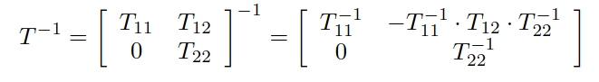

# 从零手搓昇腾矩阵求逆，加速业务基线3倍 (基于PTO指令集的Qwen3.5 GDN优化实录)

**一句话总结**: 我们用PTO指令集手搓了矩阵求逆，相比sglang和vllm-ascend里的Triton算子**加速了3倍**, 且保持了算法的数值精度; 解决这一瓶颈使得整个Gated DeltaNet模块**提速了30%**。

英文版见 [fast_inverse_part1.md](./fast_inverse_part1.md)

**复现本文性能数据**，详见：

- [PTO vs TileLang/Triton性能对比脚本](https://github.com/huawei-csl/gdn-tri-inverse)
- [性能优化版的PTO-ISA C++代码](https://github.com/huawei-csl/pto-kernels/blob/v0.1.2/csrc/kernel/kernel_tri_inv_rec_unroll.cpp)
- [易于理解的Python代码demo](https://github.com/huawei-csl/pto-dsl/tree/0.1.1/examples/aot/fast_inverse)

# 目录

- [性能瓶颈定位与关键优化结果](#motivation-and-performance-results)
- [为什么LLM要求逆？数学与代码速览](#why-need-inverse-brief-recap-of-math-and-code)
- [利用矩阵单元的快速求逆算法](#fast-inversion-algorithm-using-matrix-units)
- [用PTO Python DSL高效实现算子](#npu-kernel-implementation-in-pto-python-dsl)
- [改善数值稳定性](#improving-numerical-stability)

更详细的性能优化技巧与数值稳定性分析见[Part 2](../part2/fast_inverse_part2.md)

<a id="motivation-and-performance-results"></a>
# 性能瓶颈定位与关键优化结果

[Gated DeltaNet (GDN) 架构](https://arxiv.org/abs/2412.06464) 在Long-context LLM里很常用，最典型的有[Qwen3.5 系列](https://huggingface.co/collections/Qwen/qwen35) 和 [Kimi-Linear](https://huggingface.co/moonshotai/Kimi-Linear-48B-A3B-Instruct)。GDN及其变种的[chunkwise算法](https://sustcsonglin.github.io/blog/2024/deltanet-2/#a-chunkwise-algorithm-for-deltanet)(用于长上下文 prefill与训练场景)涉及三角矩阵的求逆运算：

<p align="center">
  
</p>

（表格来自 [Kimi Linear 论文](https://arxiv.org/abs/2510.26692)）

对[TileLang性能优化版GDN](https://github.com/tile-ai/tilelang-ascend/tree/ede78f814e5e5dfcbfe783b79f988e6b6e375a86/examples/linear_attention_and_rnn#optimize-results)进行profiling，我们发现在NPU上的求逆运算居然占了GDN模块的**40%耗时**：

<p align="center">
  
</p>

对于NPU的矩阵单元，选择更大的 **chunk size**（例如 128）可以让chunkwise算法中的大部分步骤（例如 `chunk_h`、`chunk_o`）的算力利用率更高，让GDN整体变快 (虽然大chunk的总FLOPs变多，但chunk数更少，硬件cycle数反而更少)。唯独求逆这一步是例外：最常用的[前向消元法](https://en.wikipedia.org/wiki/Triangular_matrix#Forward_substitution)不能在矩阵单元运行。

为了解决这个瓶颈，我们重新设计了一个**更快且数值稳定**的三角求逆算子。对比[sgl-kernel-npu](https://github.com/sgl-project/sgl-kernel-npu/tree/2026.03.01.post1/python/sgl_kernel_npu/sgl_kernel_npu/fla)与[vllm-ascend里的](https://github.com/vllm-project/vllm-ascend/tree/v0.17.0rc1/vllm_ascend/ops/triton/fla) Triton 实现，提速约**3 倍** (triton版本只支持到chunk size 64, 选择一样的chunk size公平对比):

<p align="center">
  
</p>

(Y轴标识的"等效带宽"和算子耗时成反比，理论极限是满带宽读取输入、写回输出、忽略计算耗时，则能接近HBW带宽的1TB/s量级)

对比 [tilelang-ascend 优化实现](https://github.com/tile-ai/tilelang-ascend/tree/786a5ef0df8e98da97bcd51440ab55a8c8253e2c/examples/linear_attention_and_rnn/opt_gdn)， 对 chunk 32/64/128分别提速3/3/1.5倍，且支持更灵活的shape与layout（tilelang版目前是全静态shape，且假设更简单的["head-first" layout](https://github.com/fla-org/flash-linear-attention/pull/338)，还不能直接上业务）。

<p align="center">
  
</p>

因为求逆的占比太高，替换一个算子使得整层GDN有30%的明显提速。基于sglang的GDN融合算子实测 (求逆之外的算子仍用原本的triton版)：

<p align="center">
  
</p>

(TODO: shorter legend name)

<a id="why-need-inverse-brief-recap-of-math-and-code"></a>
# 为什么LLM要求逆？数学与代码速览

[GDN 架构](https://arxiv.org/abs/2412.06464) 里会出现 **lower-triangular matrix** 的求逆：

<p align="center">
  
</p>

这一步来自 [Accumulating Householder Transformations](https://dl.acm.org/doi/10.1145/1141885.1141886)（复习线代基础见经典的[Golub & van Loan](https://epubs.siam.org/doi/book/10.1137/1.9781421407944) 第5.1章 Householder 变换）。除了求逆，chunkwise算法里其它步骤多是小块的矩阵乘和累加，天然映射到NPU的Cube单元或GPU的Tensor Core。

在 Hugging Face 的 [modeling_qwen3_5.py](https://github.com/huggingface/transformers/blob/v5.3.0/src/transformers/models/qwen3_5/modeling_qwen3_5.py) 代码里，基于PyTorch eager的求逆代码（作为CPU/NPU/GPU所有后端的fallback）在[torch_chunk_gated_delta_rule](https://github.com/huggingface/transformers/blob/v5.3.0/src/transformers/models/qwen3_5/modeling_qwen3_5.py#L368-L371) 中通过 [前向消元法](https://en.wikipedia.org/wiki/Triangular_matrix#Forward_substitution) 完成的：

```python
attn = -((k_beta @ key.transpose(-1, -2)) * decay_mask).masked_fill(mask, 0)
for i in range(1, chunk_size):
    row = attn[..., i, :i].clone()
    sub = attn[..., :i, :i].clone()
    attn[..., i, :i] = row + (row.unsqueeze(-1) * sub).sum(-2)
attn = attn + torch.eye(chunk_size, dtype=attn.dtype, device=attn.device)
```

验证这段代码的数值正确性：

```python
import torch
def solve_attn(attn, chunk_size=4):
    attn = attn.clone() # avoid in-place changes
    for i in range(1, chunk_size):
        row = attn[i, :i].clone()  # ignore broadcast dimensions here
        sub = attn[:i, :i].clone()
        attn[i, :i] = row + (row.unsqueeze(-1) * sub).sum(-2)
    return attn

torch.manual_seed(0)
c = 4   # can change to 8/16/32/...
A = torch.tril(torch.rand(c, c), diagonal=-1)
A_solve = solve_attn(A)
I = torch.eye(c)
print((I - A) @ (I + A_solve))  # equals to identity matrix
```

GPU上有Triton融合算子[solve_tril](https://github.com/fla-org/flash-linear-attention/blob/v0.4.2/fla/ops/utils/solve_tril.py) 在 [chunk_gated_delta_rule_fwd](https://github.com/fla-org/flash-linear-attention/blob/v0.4.2/fla/ops/gated_delta_rule/chunk.py#L48) 里调用。

NPU上，vllm/sglang等推理框架使用triton-ascend编译[类似的算子实现](https://github.com/sgl-project/sgl-kernel-npu/blob/2026.03.01.post1/python/sgl_kernel_npu/sgl_kernel_npu/fla/solve_tril.py)。

<a id="fast-inversion-algorithm-using-matrix-units"></a>

# 利用矩阵单元的快速求逆算法

论文 [Understanding Transformer from the Perspective of Associative Memory](https://arxiv.org/abs/2505.19488) 给了另一种算法，考虑到被求逆的矩阵size size一般被选为**2的幂次**（常见 16、32、64）。

<p align="center">
  
</p>
<p align="center">
  
</p>

数学推导来自[Cayley-Hamilton定理](https://en.wikipedia.org/wiki/Cayley%E2%80%93Hamilton_theorem) ，在[Part 2](../part2/fast_inverse_part2.md)详细展开。直观上，可以类比 [matrix power series](https://en.wikipedia.org/wiki/Analytic_function_of_a_matrix#Power_series) 配上 [fast exponentiation by squaring](https://en.wikipedia.org/wiki/Exponentiation_by_squaring)。

在 NumPy 里验一下算法正确性：

```python
import numpy as np
from numpy.linalg import inv

def is_power_of_2(c):
    return (c != 0) and (c & (c-1) == 0)

def strict_lower(c=4, seed=0):
    return np.tril(np.random.rand(c, c), k=-1)

def inv_trick(A):
    """
    Compute (I + A)^{-1} without explicit inversion
    """
    assert A.ndim == 2 and A.shape[0] == A.shape[1]
    c = A.shape[0]
    assert is_power_of_2(c) and c >= 4
    log2_c = int(np.log2(c))
    I = np.eye(c)
    X, Y = (I - A, A @ A)
    for i in range(log2_c - 1):
        X, Y = (X + X @ Y, Y @ Y)
    return X

for c in [4, 8, 16, 32, 64]:
    A = strict_lower(c)
    A_inv_ref = inv(A + np.eye(c))
    A_inv = inv_trick(A)
    assert np.allclose(A_inv, A_inv_ref)  # all pass
```

这样一来，基于tile计算的框架可以用**矩阵乘**快速算 `inv(I+A)`，而不必在scalar/vector单元上做细粒度的前向消元法。

<a id="npu-kernel-implementation-in-pto-python-dsl"></a>
# 用PTO Python DSL高效实现算子

我们用 **PTO-DSL** 把前文的 NumPy 算法轻松实现到NPU上。完整代码见 [`fast_inverse/basic_dense` 示例](https://github.com/huawei-csl/pto-dsl/blob/0.1.1/examples/aot/fast_inverse/basic_dense/inverse_builder.py#L104-L158)。若是初次接触PTO指令与昇腾算子编程，建议先看我们上一篇[从零手搓昇腾Matmul](https://github.com/huawei-csl/pto-dsl/blob/0.1.1/examples/aot/matmul_optimization_guide/mamtul_optim_guide_zh.md)。

核心代码逻辑很直观，和前文NumPy示例几乎一一对应：

```python
# Mirrors:
# for i in range(log2_c - 1):
#     X, Y = (X + X @ Y, Y @ Y)
for iter_idx in pto.range(c0, log2_blocksize, c1):
    tile.mov(x_l1, a_l0)
    tile.mov(i_l1, b_l0)
    tile.matmul(a_l0, b_l0, c_l0)

    tile.mov(y_l1, b_l0)
    tile.matmul_acc(c_l0, a_l0, b_l0, c_l0)  # x + x @ y

    with pto.if_context(iter_idx + c1 < log2_blocksize):
        tile.mov(c_l0, x_l1)
        tile.mov(y_l1, a_l0)
        tile.matmul(a_l0, b_l0, c_l0)
        tile.mov(c_l0, y_l1)  # y = y @ y
```

与NumPy代码唯一的区别是：上面的代码显式地要求**中间结果要驻留在`L1` buffer复用**，而不写回global memory。`tile.mov`(而不是`store`)确保了数据驻留在SRAM。（对比triton-ascend： `tl.load`/`tl.store` 并不会显式区分 `L1` 和 `L0`，L1复用依赖编译器内部优化）

这版代码并未考虑double buffering等性能优化，相对基线就有**3x**加速。按等效带宽衡量（Triton基线大约 40～50 GB/s）：

<p align="center">
  
</p>

可惜这个算法**极其数值不稳定**，无法用于业务。

<a id="improving-numerical-stability"></a>

# 改善数值稳定性

前文算法遇到条件数不好的矩阵会产生数值不稳定，例如考虑[非正定矩阵](https://mathworld.wolfram.com/IndefiniteMatrix.html)：对角为 1.0、下三角 off-diagonal 全为 0.5，类型为 `float16`：

```python
dtype = np.float16

def ill_matrix(n, dtype=dtype):
    """
    ill_matrix(4) gives:
    array([[0. , 0. , 0. , 0. ],
           [0.5, 0. , 0. , 0. ],
           [0.5, 0.5, 0. , 0. ],
           [0.5, 0.5, 0.5, 0. ]], dtype=float16)
    """
    return 0.5 * np.tril(np.ones((n, n), dtype=dtype), k=-1)

for c in [4, 8, 16, 32, 64]:
    A = ill_matrix(c)
    A_inv_ref = inv(A.astype(np.float64) + np.eye(c))
    A_inv = inv_trick(A)  # defined before
    error = np.linalg.norm(A_inv - A_inv_ref)
    print(f"c={c} | error = {error:.3e}")  # overflow when c=64

# output:
# c=4 | error = 0.000e+00
# c=8 | error = 0.000e+00
# c=16 | error = 0.000e+00
# c=32 | error = 3.255e+00
# c=64 | error = nan
```

当 `(A+I)` 更接近 [对角占优](https://en.wikipedia.org/wiki/Diagonally_dominant_matrix) 时，数值会好很多：若 off-diagonal 是 0.1 而不是 0.5，误差范数可以压到 1e-3 以下。实际 GDN 里矩阵元素大致落在 [-1, 1]（见[这篇讨论](https://spaces.ac.cn/archives/11563)），**仍不足以从理论上保证** 数值稳定性。

提高数值稳定性可以用[分块求逆](https://en.wikipedia.org/wiki/Block_matrix#Inversion)：

<p align="center">
  
</p>

（参见 James Demmel 的论文 [Fast Linear Algebra is Stable](https://arxiv.org/abs/math/0612264)）

作为示例，我们只递归一层，对内层 tile 仍复用前面的 “不稳定快速算法”：

```python
def inv_stable(A):
    # more stable algorithm for inv(A + I)
    n = A.shape[0]
    n_half = n//2
    A_inv = np.zeros_like(A)  # same shape and type as A
    A11 = A[0:n_half, 0:n_half]
    A22 = A[n_half:, n_half:]
    A21 = A[n_half:, 0:n_half]
    A_inv[0:n_half, 0:n_half] = inv_trick(A11)
    A_inv[n_half:, n_half:] = inv_trick(A22)
    A_inv[n_half:, 0:n_half] = - A_inv[n_half:, n_half:] @ A21 @ A_inv[0:n_half, 0:n_half]
    return A_inv

for c in [8, 16, 32, 64]:
    A = ill_matrix(c)  # defined before
    A_inv_ref = inv(A.astype(np.float64) + np.eye(c))
    A_inv = inv_stable(A)
    error = np.linalg.norm(A_inv - A_inv_ref)
    print(f"c={c} | error = {error:.3e}")
```

```
# outputs:
# c=8 | error = 0.000e+00
# c=16 | error = 0.000e+00
# c=32 | error = 8.885e-08
# c=64 | error = 5.201e+00
```

`c=32`的精度相比之前大幅改善，`c=64` 也不再溢出。代价是矩阵乘的粒度减半，Cube / Tensor Core的利用率会下降。若使用FP32的矩阵乘 ()，`c=64` 也能对齐到很高精度。

基于PTO-DSL的分块求逆实现见[`fast_inverse/block_inversion` 示例](https://github.com/huawei-csl/pto-dsl/blob/0.1.1/examples/aot/fast_inverse/block_inversion/inverse_builder.py#L142-L219)。

我们最终使用的（又快又稳定的）算子，对分块求逆进行了多层unrolling，在最内层复用“不稳定快速算法”，偶尔加几步SRAM上的[iterative refinement](https://en.wikipedia.org/wiki/Iterative_refinement) 进一步修正精度。要把这种复杂算法优化到峰值性能，还需要更细节的调优，放在[Part 2](../part2/fast_inverse_part2.md)里展开。
