# 从零手搓5种矩阵求逆算子，加速昇腾业务基线3倍 (基于PTO指令集的Qwen3.5 GDN优化实录)

**一句话总结**: 我们用PTO指令集手搓了矩阵求逆，相比SGLang与vLLM-Ascend里的Triton算子**加速了3倍**, 且保持了算法的数值精度; 解决这一瓶颈使得整个Gated DeltaNet模块**提速了20%～40%**。

英文版见 [fast_inverse.md](./fast_inverse.md)

**复现本文全部结果**，见：

- [性能与精度测试脚本，包含与TileLang/Triton基线对比](https://github.com/huawei-csl/gdn-tri-inverse)
- [性能优化版的PTO-ISA C++代码](https://github.com/huawei-csl/pto-kernels/blob/v0.1.2/csrc/kernel/kernel_tri_inv_rec_unroll.cpp)
- [易于理解的Python代码示例](https://github.com/huawei-csl/pto-dsl/tree/0.1.1/examples/aot/fast_inverse)

# 目录

- [性能瓶颈定位与优化结果](#motivation-and-performance-results)
- [LLM 为何需要矩阵求逆？数学与代码速览](#why-do-llms-need-matrix-inverse-brief-recap-of-math-and-code)
- [亲和矩阵单元的三角求逆快速算法](#designing-fast-and-accurate-triangular-inversion-algorithms-using-matrix-units)
  - [NPU架构回顾](#ai-accelerators-and-ascend-npus)
  - [对算法的要求](#desired-algorithm-properties)
  - [基础算法: 向量化的高斯消元法 (VCS, MCS)](#a-first-attempt-via-backward-substitution-vectorized-and-matrix-based-column-sweep-vcs-and-mcs)
  - [提高计算效率: 基于纯矩阵乘的求逆 (MCH)](#a-very-fast-matrix-product-based-algorithm)
  - [提高数值精度：分块递归求逆法 (MBH)](#a-more-stable-matrix-based-algorithm-revisiting-bunch-and-hopcroft-mbh)
  - [兼顾效率与精度：MCH与MBH结合 (MXR)](#the-best-of-both-worlds-combining-the-speed-of-mch-and-the-stability-of-mbh)
  - [5种算法对比总结](#summary-of-methods)
- [基于昇腾的深入调优](#deep-dive-on-ascend-910b-implementations)
  - [用PTO-ISA实现MXR算法的底层细节](#low-level-implementation-of-mxr-using-pto-isa)
  - [优化技巧之高效搬运对角分块阵](#efficiently-moving-diagonal-blocks-between-l1-and-l0)
  - [优化技巧之Double-buffer与异步并行](#double-buffering-and-intra-core-parallelasynchronous-execution)
- [端到端加速chunkwise Gated DeltaNet](#end-to-end-speed-up-for-chunkwise-gated-deltanet)
- [附录](#appendix)
  - [数值稳定性分析](#background-on-floating-point-and-stability-analysis)
  - [各算法的精度对比](#detailed-stability-analysis-of-the-methods)
- [参考文献](#bibliography)

<a id="motivation-and-performance-results"></a>
# 性能瓶颈定位与优化结果

[Gated DeltaNet (GDN) 架构](https://arxiv.org/abs/2412.06464) 在long-context LLM架构中很常用，典型代表包括 [Qwen3.5 系列](https://huggingface.co/collections/Qwen/qwen35) 与 [Kimi-Linear](https://huggingface.co/moonshotai/Kimi-Linear-48B-A3B-Instruct)。GDN 及多种变体在其 [chunkwise 算法](https://sustcsonglin.github.io/blog/2024/deltanet-2/#a-chunkwise-algorithm-for-deltanet)（用于长上下文 prefill 与训练）中都需要对三角矩阵求逆：

<p align="center">
  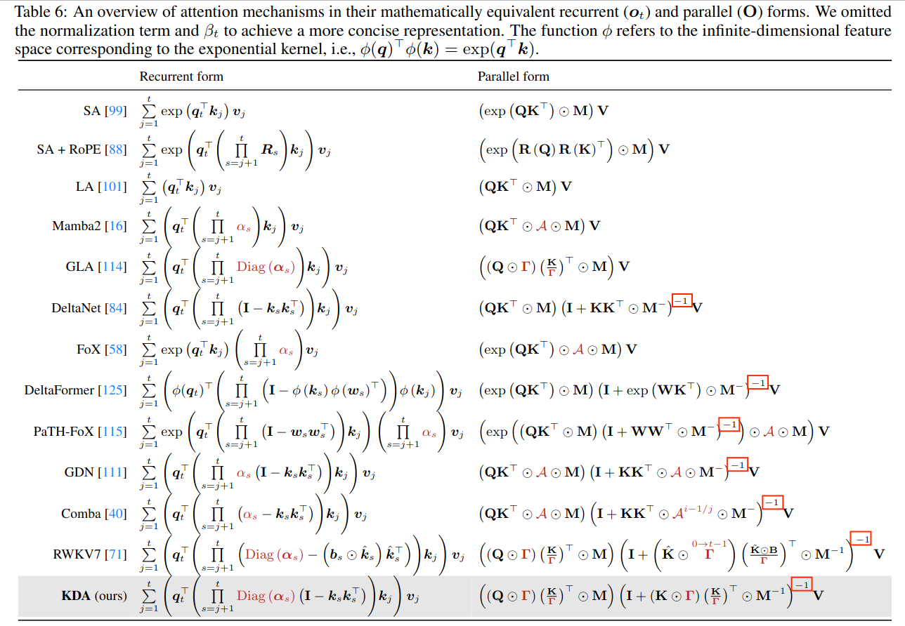
</p>

（表格来自 [Kimi Linear 论文](https://arxiv.org/abs/2510.26692)）

根据对 [TileLang 优化版 GDN](https://github.com/tile-ai/tilelang-ascend/tree/ede78f814e5e5dfcbfe783b79f988e6b6e375a86/examples/linear_attention_and_rnn#optimize-results) 的 profiling，在 NPU 上**三角求逆约占整体耗时的 ~40%**：

<p align="center">
  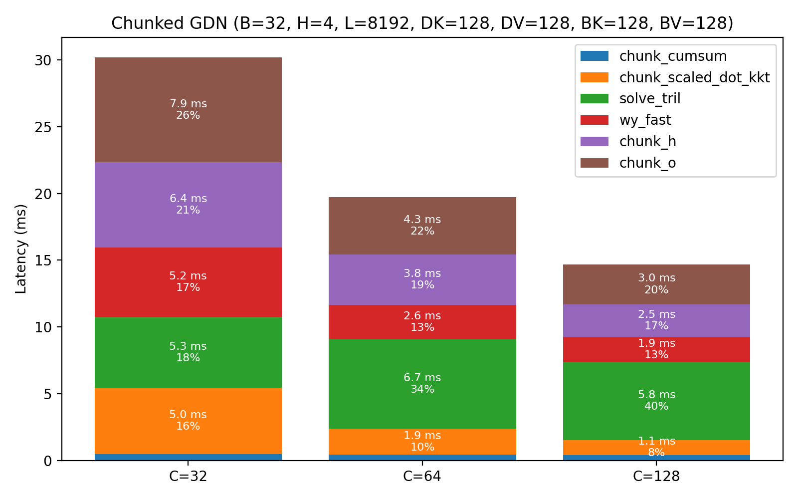
</p>

对于昇腾架构，更大的 chunk size（例如 128）能提高矩阵单元(Cube)的 FLOP 利用率，从而加速 GDN 内的多数计算步骤；但三角求逆步骤是例外 -- 它依赖细粒度的前向消元法（forward substitution），无法在矩阵单元上执行。

为解决这一瓶颈，我们实现了一个**快速且数值稳定**的三角求逆算子：对比 [SGLang Ascend 后端](https://github.com/sgl-project/sgl-kernel-npu/tree/2026.03.01.post1/python/sgl_kernel_npu/sgl_kernel_npu/fla) 与 [vllm-ascend](https://github.com/vllm-project/vllm-ascend/tree/v0.17.0rc1/vllm_ascend/ops/triton/fla) 中的 Triton 实现，实测快了**3 倍** (对比相同chunk size；triton基线不支持超过64的chunk)。

<p align="center">
  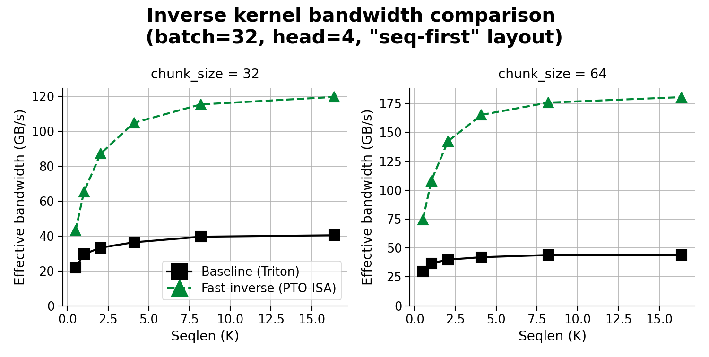
</p>

（纵轴「等效带宽」与 算子耗时成反比。理论峰值带宽对应“只读入输入、写出输出”而忽略计算，此时带宽可接近 HBM 峰值1 TB/s量级。）

对比 [tilelang-ascend 优化实现](https://github.com/tile-ai/tilelang-ascend/tree/786a5ef0df8e98da97bcd51440ab55a8c8253e2c/examples/linear_attention_and_rnn/opt_gdn)，在 chunk size 为 32/64/128 时加速分别为 **3/3/1.5 倍**；且在 shape 与 data layout 上更灵活（该tilelang算子目前使用全静态shape与更易处理的 [「head-first」layout](https://github.com/fla-org/flash-linear-attention/pull/338)，尚不能直接用于业务）。

<p align="center">
  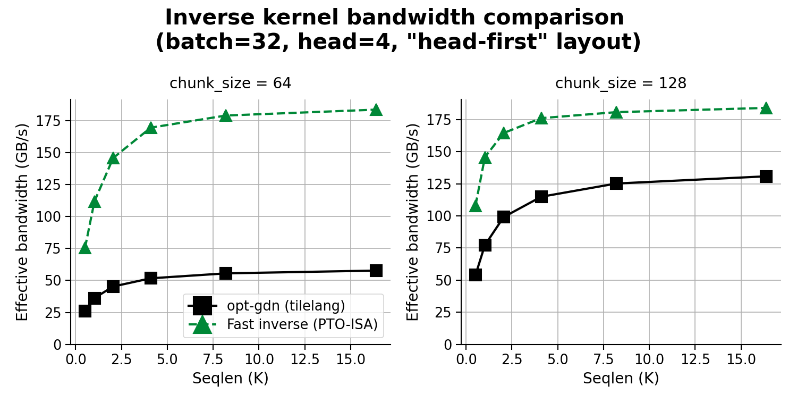
</p>

整个GDN层使用了新算子后也有明显加速（代码从SGLang提取；求逆以外仍用原Triton算子）：

<p align="center">
  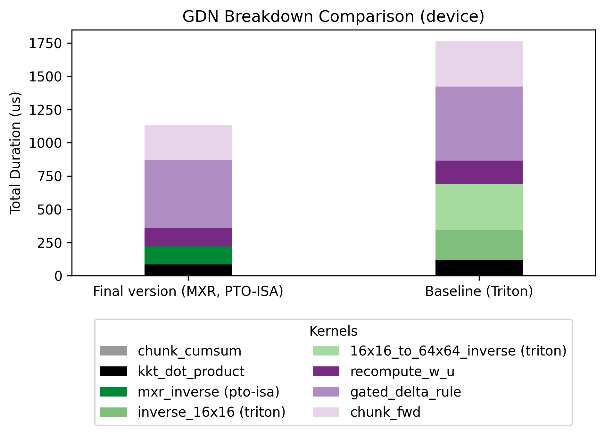
</p>

<a id="why-do-llms-need-matrix-inverse-brief-recap-of-math-and-code"></a>
# LLM 为何需要矩阵求逆？数学与代码速览

[GDN 架构](https://arxiv.org/abs/2412.06464) 涉及**下三角矩阵**的求逆：

<p align="center">
  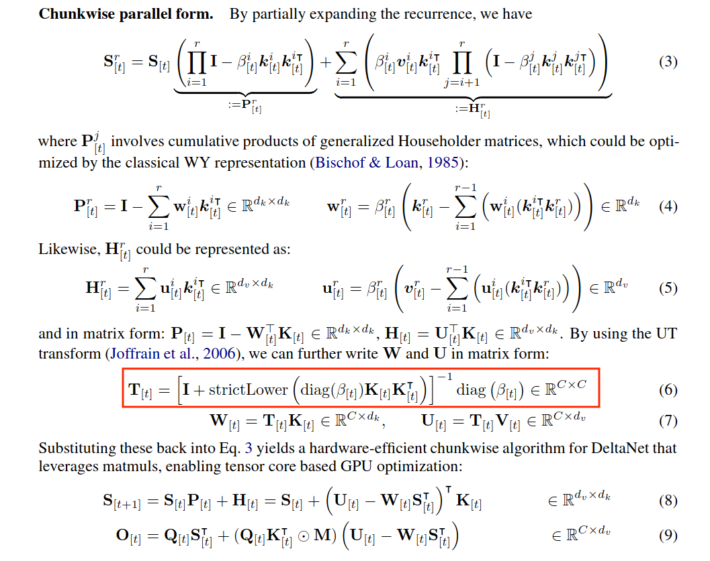
</p>

该求逆来自 [Accumulating Householder Transformations](https://dl.acm.org/doi/10.1145/1141885.1141886)（线代复习可参见经典 [Golub & van Loan](https://epubs.siam.org/doi/book/10.1137/1.9781421407944) 第 5.1 节 Householder 变换）。除求逆外，chunkwise 算法中的其它运算多为小块矩阵乘加，天然映射到昇腾的 Cube 单元或 GPU 的 Tensor Core。

在 Hugging Face 的 [modeling_qwen3_5.py](https://github.com/huggingface/transformers/blob/v5.3.0/src/transformers/models/qwen3_5/modeling_qwen3_5.py) 实现里，[前向消元法](https://en.wikipedia.org/wiki/Triangular_matrix#Forward_substitution) 出现在函数[torch_chunk_gated_delta_rule](https://github.com/huggingface/transformers/blob/v5.3.0/src/transformers/models/qwen3_5/modeling_qwen3_5.py#L368-L371)中，作为多种硬件后端(无论CPU/NPU/GPU)的Torch eager模式fallback：

```python
attn = -((k_beta @ key.transpose(-1, -2)) * decay_mask).masked_fill(mask, 0)
for i in range(1, chunk_size):
    row = attn[..., i, :i].clone()
    sub = attn[..., :i, :i].clone()
    attn[..., i, :i] = row + (row.unsqueeze(-1) * sub).sum(-2)
attn = attn + torch.eye(chunk_size, dtype=attn.dtype, device=attn.device)
```

简单测试确认其行为：

```python
import torch
def solve_attn(attn, chunk_size=4):
    attn = attn.clone() # avoid in-place changes
    for i in range(1, chunk_size):
        row = attn[i, :i].clone()  # ignore broadcast dimensions here
        sub = attn[:i, :i].clone()
        attn[i, :i] = row + (row.unsqueeze(-1) * sub).sum(-2)
    return attn

torch.manual_seed(0)
c = 4   # can change to 8/16/32/...
A = torch.tril(torch.rand(c, c), diagonal=-1)
A_solve = solve_attn(A)
I = torch.eye(c)
print((I - A) @ (I + A_solve))  # equals the identity matrix
```

GPU后端默认走Triton融合算子 [solve_tril](https://github.com/fla-org/flash-linear-attention/blob/v0.4.2/fla/ops/utils/solve_tril.py) ，在 [chunk_gated_delta_rule_fwd](https://github.com/fla-org/flash-linear-attention/blob/v0.4.2/fla/ops/gated_delta_rule/chunk.py#L48) 内被调用。

昇腾上，vLLM/SGLang 等推理框架用 Triton-Ascend 编译 [类似的算子](https://github.com/sgl-project/sgl-kernel-npu/blob/2026.03.01.post1/python/sgl_kernel_npu/sgl_kernel_npu/fla/solve_tril.py)。


<a id="designing-fast-and-accurate-triangular-inversion-algorithms-using-matrix-units"></a>
# 亲和矩阵单元的三角求逆快速算法

<a id="ai-accelerators-and-ascend-npus"></a>
## NPU架构回顾

本文用Ascend 910B测试性能。Ascend 910B的结构示意如下。每个 AI-core 含两个 *AIV*（向量核）与一个 *AIC*（Cube核，负责矩阵乘）。绝大多数的FLOP由Cube核提供。更多架构细节见[官方文档](https://www.hiascend.com/document/detail/en/canncommercial/800/opdevg/Ascendcopdevg/atlas_ascendc_10_0008.html)。

<p align="center">
  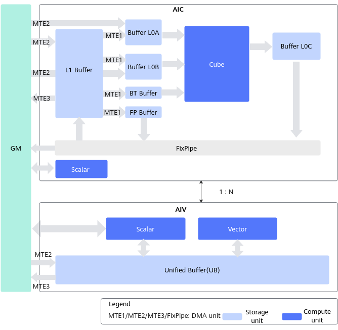
</p>

我们的算子用[PTO-ISA](https://gitcode.com/cann/pto-isa)编写，既支持Ascend 910B，也支持新的[Ascend 950](https://gitcode.com/cann/community/tree/master/events/meetup/slides/950/20260316)。

<a id="desired-algorithm-properties"></a>
## 对算法的要求

对下文提出的每一种矩阵求逆算法，我们都会指出相应的：

- **计算复杂度**：基本运算次数（矩阵乘次数、向量指令、标量操作等）
- **硬件亲和程度**：尤其是能否发挥NPU的矩阵算力
- **数值稳定性**：对舍入误差的robust程度（数值稳定性定义见[附录](#background-on-floating-point-and-stability-analysis)）

理想的算法需要兼顾运行效率和数值稳定性。

<a id="a-first-attempt-via-backward-substitution-vectorized-and-matrix-based-column-sweep-vcs-and-mcs"></a>
## 基础算法: 向量化的高斯消元法 (VCS, MCS)

- **VCS**（Vector Column-Sweep，向量列扫）：按列做前向代入，每一步用长度递减的向量运算更新一列。
- **MCS**（Matrix-based Column-Sweep，矩阵列扫）：同一套列扫思想，但写成一串初等块矩阵的链式矩阵乘，便于走矩阵单元。

列扫（column-sweep）是按列做前向消元的标准写法（参见文献 [4]）。用 NumPy 可直观实现如下：

<details>
<summary>VCS NumPy code</summary>

```python
import numpy as np

def tri_inv_vcs(U: np.ndarray) -> np.ndarray:
    """
    Vector Column-Sweep algorithm which computes the 
    inverse of A = I + U, where: 
      I is the identity
      U is strictly upper triangular
    """
    n = U.shape[0]
    A_inv = np.zeros_like(U, dtype=U.dtype)

    for j in range(n):
        A_inv[j,j] = 1.0
    
        for k in range(n - 1, 0, -1):
            A_inv[:k, j] -= U[:k, k] * A_inv[k, j]

    return A_inv
```

</details>

- **复杂度**： $n$ 次**向量运算**，长度依次为 $n,n-1,n-2,\ldots,2,1$ $\rightarrow O(n^2)$ flops
- **稳定性**：该算法被证明**数值稳定**，见文献[4]。

该方法的主要问题是**没有**利用NPU矩阵单元。可以把向量运算改写成矩阵形式（见文献[4]第 3.2.1 节公式3.8/3.9）。这里用一个 $3\times 3$ 例子说明。

设 $A$ 为：

```math
A =
\begin{pmatrix}
1 & 2 & 3 \\
0 & 1 & 4 \\
0 & 0 & 1
\end{pmatrix}.
```

可直接验证 $A^{-1}$ 可写为

```math
A^{-1} = M_1 M_2 =
\begin{pmatrix}
1 & -2 & 0 \\
0 & 1 & 0 \\
0 & 0 & 1
\end{pmatrix}\begin{pmatrix}
1 & 0 & -3 \\
0 & 1 & -4 \\
0 & 0 & 1
\end{pmatrix}.
```

对一般的 $n\times n$ shape, `MCS` 算法生成 $M_{n-1}M_{n-2}\cdots M_{1}$ 并做链式矩阵乘。相比起 `VCS` 算法，`MCS` 算法能走矩阵单元；代价是对阶数为 $n$ 的矩阵需要 $n-1$ 次矩阵乘。

<details>
<summary>MCS NumPy code</summary>

```python
import numpy as np

def tri_inv_mcs(U: np.ndarray) -> np.ndarray:
    """
    MCS Algorithm. Uses matrix products to compute the 
    inverse of A = I + U, where: 
      I is the identity
      U is strictly upper triangular
    """
    n = U.shape[0]
    I = np.eye(n, dtype=U.dtype)
    
    U = I - U
    A_inv = I.copy()
    
    for k in reversed(range(n)):
        M_k = I.copy()
        M_k[:, k] = U[:, k]
        A_inv = M_k @ A_inv
    
    return A_inv
```

</details>

- **复杂度**： $n-1$ 次尺寸为 $n\times n$ 的 **matmul**，以及长度为 $O(n)$ 的 $O(n)$ 次**向量运算**
- **稳定性**：与 VCS 一样**数值稳定**

我们的[pto-kernels代码仓里](https://github.com/huawei-csl/pto-kernels/tree/v0.1.2/csrc/kernel)包含了`VCS`和`MCS`的实现，但二者的计算效率都不高，只能和基线持平。`VCS`的NPU亲和度太差，而`MCS`的理论复杂度太高，下文设计更快的算法。

<a id="a-very-fast-matrix-product-based-algorithm"></a>
## 提高计算效率: 基于纯矩阵乘的求逆 (MCH)

- **MCH**（Matrix Cayley-Hamilton）：用 Cayley–Hamilton 定理把 $(I+U)^{-1}$ 写成交错符号的幂级数 $I-U+U^2-\cdots$，再通过反复矩阵平方与累乘（思路类似快速幂），在约 $O(\log n)$ 次 $n\times n$ 矩阵乘内得到逆。

一般的级数展开需要 $O(n)$ 次 $n\times n$ 规模的矩阵乘。文献 [8] 利用 **$A$ 的阶数常为 2 的幂**（常见 16、32、64），去掉多余项，进一步节省了计算：

<p align="center">
  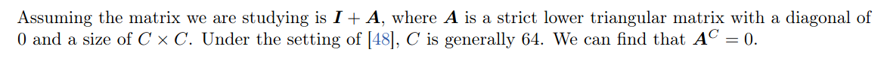
</p>
<p align="center">
  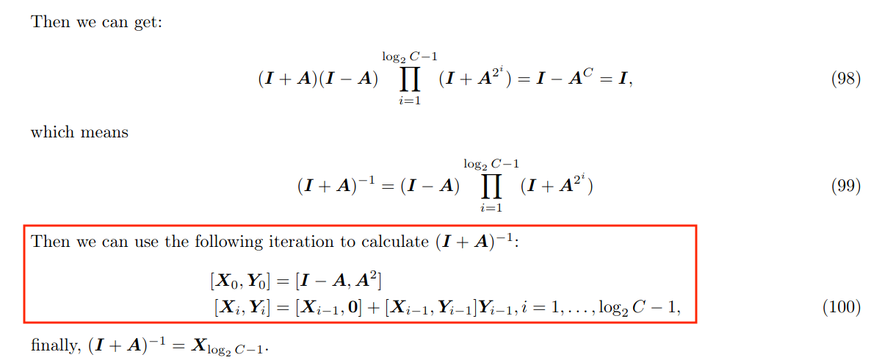
</p>

其来源是 [Cayley–Hamilton 定理](https://en.wikipedia.org/wiki/Cayley%E2%80%93Hamilton_theorem)，用特征多项式表达逆矩阵，即：

$$
(I+U)^{-1}=I-U+U^2-U^3+\cdots+(-1)^nU^n.
$$

直观上类似 [矩阵幂级数](https://en.wikipedia.org/wiki/Analytic_function_of_a_matrix#Power_series) 配合 [平方快速幂](https://en.wikipedia.org/wiki/Exponentiation_by_squaring)。下文称该算法为 **MCH**（Matrix Cayley-Hamilton）。总需 $O(\log(n))$ 次矩阵乘：

**Algorithm MCH**$(L)$:

1. $I\gets$ 规模为 $n$ 的单位矩阵  
2. $X \gets I - L$  
3. $Y \gets L$  
4. for $i=1,...,\lfloor \log(n) \rfloor-1$:  
    - $Y \gets Y\cdot Y$  
    - $X \gets X + X \cdot Y$  
5. return $X$

用NumPy快速校验正确性：

<details>
<summary>MCH NumPy code</summary>

```python
import numpy as np
from numpy.linalg import inv

def is_power_of_2(c):
    return (c != 0) and (c & (c-1) == 0)

def strict_lower(c=4, seed=0):
    return np.tril(np.random.rand(c, c), k=-1)

def tri_inv_mch(A):
    """
    Compute (I + A)^{-1} without explicit inversion
    """
    assert A.ndim == 2 and A.shape[0] == A.shape[1]
    c = A.shape[0]
    assert is_power_of_2(c) and c >= 4
    log2_c = int(np.log2(c))
    I = np.eye(c)
    X, Y = (I - A, A @ A)
    for i in range(log2_c - 1):
        X, Y = (X + X @ Y, Y @ Y)
    return X

for c in [4, 8, 16, 32, 64]:
    A = strict_lower(c)
    A_inv_ref = inv(A + np.eye(c))
    A_inv = tri_inv_mch(A)
    assert np.allclose(A_inv, A_inv_ref)  # all pass
```
</details>

这一技巧让基于 tile 计算的编程框架能快速算 `inv(I+A)`，而不必在标量/向量核上做细粒度的前向消元。

### NPU kernel：PTO Python DSL 实现

上文的NumPy算法可以很容易地翻译到PTO DSL，完整代码见 [`fast_inverse/basic_dense` 示例](https://github.com/huawei-csl/pto-dsl/blob/0.1.1/examples/aot/fast_inverse/basic_dense/inverse_builder.py#L104-L158)。若刚接触 PTO，可先读我们另一篇的 [Matmul优化指南](https://github.com/huawei-csl/pto-dsl/blob/0.1.1/examples/aot/matmul_optimization_guide/mamtul_optim_guide_zh.md)，对 Ascend NPU 与 PTO 编程有入门介绍。

算子的主要代码与 NumPy 版一一对应：

```python
# Mirrors:
# for i in range(log2_c - 1):
#     X, Y = (X + X @ Y, Y @ Y)
for iter_idx in pto.range(c0, log2_blocksize, c1):
    tile.mov(x_l1, a_l0)
    tile.mov(i_l1, b_l0)
    tile.matmul(a_l0, b_l0, c_l0)

    tile.mov(y_l1, b_l0)
    tile.matmul_acc(c_l0, a_l0, b_l0, c_l0)  # x + x @ y

    with pto.if_context(iter_idx + c1 < log2_blocksize):
        tile.mov(c_l0, x_l1)
        tile.mov(y_l1, a_l0)
        tile.matmul(a_l0, b_l0, c_l0)
        tile.mov(c_l0, y_l1)  # y = y @ y
```

与 NumPy 的区别是我们**显式要求**中间结果留在 `L1`，避免写回 global memory；`tile.mov` 确保了数据的locality。（在 Triton-Ascend 上相对麻烦点，因为 `tl.load`/`tl.store` 不区分 `L1` 与 `L0`，全靠编译器优化）

这一朴素实现（无 double-buffering 等进一步优化）在等效带宽上已达到 Triton 基线的 **3 倍**（Triton 约 40～50 GB/s）：

<p align="center">
  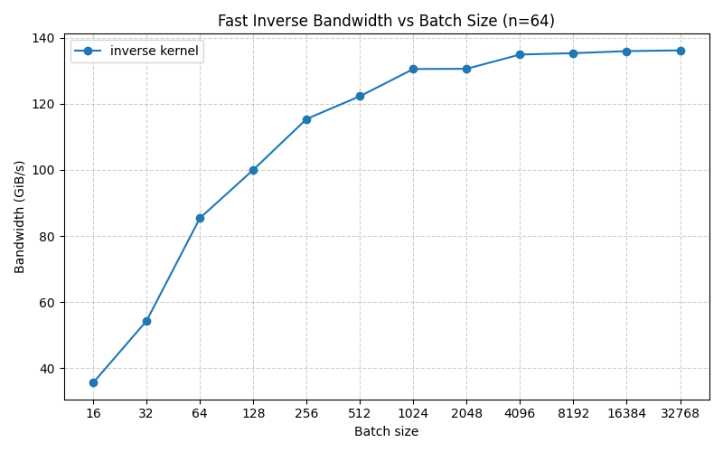
</p>

可惜这个算法的数值稳定性很差，无法在真实业务里使用。

### 理论分析

- **复杂度**：约 $2\log_2(n)$ 次 $n\times n$ 矩阵乘。  
- **稳定性**：该算法**数值不稳定**。

下图对四种方法计算 $I+L$ 的逆（ $L$ 为严格下三角，元素在 $[0,1/2)$ 上均匀随机，与 GDN 中量级相近），考察相对误差。`np_inv`、`VCS`、`MCS` 在 `float32` 下至少约 7 位有效数字、在 `float16` 下至少约 3 位，且对矩阵规模 `16,32,64,128` 均成立；而 **MCH** 随规模增大误差急剧恶化：`n=128` 时 `float32` 最大相对误差可超 $10^3$，`float16` 甚至出现 `NaN`！

<p align="center">
  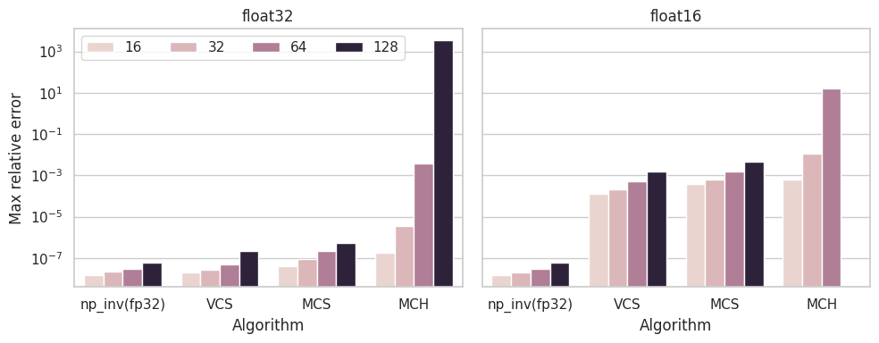
</p>


「不稳定」的根源与「为何快」同源：都是因为连续的矩阵平方。下面给出一个误差可任意变大的「人工例子」：全 1 下三角矩阵 $L_{ones}$，其逆有简单解析解：

```math
L_{ones} = \begin{pmatrix}
1 & 0 & 0 & 0 & \cdots & 0 \\
1 & 1 & 0 & 0 & \cdots & 0 \\
1 & 1 & 1 & 0 & \cdots & 0 \\
\vdots & \vdots & \vdots & \ddots & 0 & 0 \\
1 & 1 & 1 & \cdots & 1 & 0 \\
1 & 1 & 1 & \cdots & 1 & 1 \\
\end{pmatrix}
,\qquad
L^{-1}_{ones} = \begin{pmatrix}
1 & 0 & 0 & 0 & \cdots & 0 \\
-1 & 1 & 0 & 0 & \cdots & 0 \\
0 & -1 & 1 & 0 & \cdots & 0 \\
\vdots & \ddots & \ddots & \ddots & 0 & 0 \\
0 & \cdots & 0 & -1 & 1 & 0 \\
0 & \cdots & 0 & 0 & -1 & 1 \\
\end{pmatrix}
```

$L_{ones}$ 的条件数其实很小；但在算法执行中，**第四次迭代**起矩阵 $Y$ 的元素在 **fp16** 下就会溢出到 **inf**。用标准数值分析工具可进一步发现，该算法的浮点误差相对 $n$ **指数增长**。

下节介绍的MBH，虽然对矩阵单元的利用率不是最高，但数值稳定性明显提高。

<a id="a-more-stable-matrix-based-algorithm-revisiting-bunch-and-hopcroft-mbh"></a>
## 提高数值精度：分块递归求逆法 (MBH)

- **MBH**：沿用 Bunch–Hopcroft 的分块三角求逆公式，把矩阵对半划分，递归求小块的逆并用矩阵乘拼回。实现层面，把递归**展开（unrolled recursion）**，把底层大量小矩阵乘合并成适合矩阵单元的大块乘。（最早提出该方法的文献应该是 Bunch 与 Hopcroft [1]，故称 **MBH**）。

考虑分块求逆公式：

```math
A^{-1} =
\begin{pmatrix}
A_{11} & A_{12} \\
0 & A_{22}
\end{pmatrix}^{-1}
=
\begin{pmatrix}
A^{-1}_{11} & -A^{-1}_{11}A_{12}A_{22}^{-1} \\
0 & A_{22}^{-1}
\end{pmatrix}
```

每步要算两个规模减半的矩阵的逆，以及两次规模减半的矩阵乘。

为了用满矩阵单元，需把递归**展开（unroll）**，把递归最底层的众多小矩阵乘，合并成更大的乘积。完整优化实现在后文说明。

<details>
<summary>MBH NumPy code</summary>

```python
def even_blocks(A, bsz):
    n = A.shape[0]
    B = np.zeros((n, n), dtype=A.dtype)
    for idx in range(0, n, 2 * bsz):
        B[idx:idx + bsz, idx:idx + bsz] = A[idx:idx + bsz, idx:idx + bsz]
    return B

def odd_blocks(A, bsz):
    n = A.shape[0]
    B = np.zeros((n, n), dtype=A.dtype)
    for idx in range(bsz, n, 2 * bsz):
        B[idx:idx + bsz, idx:idx + bsz] = A[idx:idx + bsz, idx:idx + bsz]
    return B

def tri_inv_mbh(A, X = None, starting_block_size = 1):
    MA = -A
    n = A.shape[0]
    I = np.eye(n).astype(A.dtype)
    if X is None:
        X = I.copy()
    block_size = starting_block_size
    while block_size < n:
        LX = even_blocks(X, block_size)
        RX = odd_blocks(X, block_size)
        X = (LX @ MA + I) @ RX + LX
        block_size = block_size * 2
    return X
```

</details>

分析：

- **复杂度**：约 $2\log_2(n)$ 次 $n\times n$ 矩阵乘。  
- **稳定性**：算法为 **logarithmically stable**（证明见 [2]）。

<a id="the-best-of-both-worlds-combining-the-speed-of-mch-and-the-stability-of-mbh"></a>
## 兼顾效率与精度：MCH与MBH结合 (MXR)

先前提到的`MCH`不稳定算法，不适合单独使用，但是可以作为算法组件和`MBH`配合使用。

- **MXR**（Mixed MCH+MBH）：对角上的小块用 **MCH** 快速求逆，再用 **MBH** 全局组装。计算效率不比MCH差太多，而稳定性又接近MBH。

Hybrid 算法流程为：

- 用 **MCH** 求 $A$ 的**小对角块**的逆，每块 $16\times 16$ 。选 16 的原因：  
  1. Cube unit可以做 $16\times 16$ 的矩阵乘；  
  2. 块再大则 **MCH** **明显出现不稳定**，即便条件数很好的矩阵也可能出 `NaN`（后文实验会体现）。  
- 再用 `starting_block_size=16` 的 **MBH** 拼出全局的逆。

分析：

- **复杂度**：约 $2\log_2(n)$ 次 $n\times n$ 矩阵乘。  
- **稳定性**：不稳定部分（MCH）只做**常数次**迭代，误差不再随 $n$ 指数增长。严格说仍是 **logarithmically stable**，与 MBH 同类；但因开头有不稳定步骤，一般比纯 MBH 更易积累误差。

<details>
<summary>MXR NumPy code</summary>

```python
def tri_inv_mxr(A):
    n = A.shape[0]
    block_size = 16
    DA = even_blocks(A, block_size) + odd_blocks(A, block_size)
    X = tri_inv_mch(DA, max_block_size=block_size)
    X = tri_inv_mbh(A, X, starting_block_size=block_size)
    return X
```

</details>

MXR 的简洁 PTO Python DSL 实现见 [fast_inverse/block_inversion](https://github.com/huawei-csl/pto-dsl/tree/0.1.1/examples/aot/fast_inverse/block_inversion)（教学向、未做性能调优，且只展开一层递归；完整优化版见后文。）

<a id="summary-of-methods"></a>
## 5种算法对比总结

汇总前述所有方法的计算效率与数值稳定性：

| **Method** | **Description** | **# MatMuls** | **Stability** | **Notes** |
|----|----|----|----|----|
| **VCS** | Vector column-sweep (forward substitution) | **0** | stable [6] | 仅标量/向量运算（axpy 风格） |
| **MCS** | Matrix-based column-sweep | $n-1$ | stable [6] | 每输出一列一次矩阵乘 |
| **MCH** | Cayley–Hamilton / inverse trick | **$\approx 2\log n $** | unstable | 很快且实现简单，但不稳定 |
| **MBH** | Unrolled recursion (fast triangular inversion) | **$\approx 2\log n$** | log-stable [2] | 高效实现依赖结构化 DataCopy |
| **MXR** | Mixed MCH+MBH | $\approx 2\log n$ | log-stable [2] | 兼具 MBH 的稳定性与 MCH 的速度 |

<a id="deep-dive-on-ascend-910b-implementations"></a>
# 基于昇腾的深入调优

本节讲解基于 PTO-ISA 的实现细节。

<a id="low-level-implementation-of-mxr-using-pto-isa"></a>
## 用PTO-ISA实现MXR算法的底层细节

回顾 **MXR** 的两部分：

1. 第一部分用 **MCH** 求矩阵的 $(16\times 16)$ 对角小块的逆；  
2. 第二部分用展开后的 **MBH** 组装完整逆。

若每条矩阵乘指令只做 $16\times 16$，却反复只算 $2\times 2$ 的积，浪费严重。理想做法是把 8 个这样的 $2\times 2$ 积**嵌入**更大的 $16\times 16$ 对角块中一次完成。

为此我们研究算法的展开形式：先把矩阵的对角块拷到两个新矩阵里。设 block\_size $\in\{2, 4, 8, \ldots, n/2\}$，定义

```math
D=\begin{pmatrix}
X_{0,0} & 0 & \cdots & 0 & 0 \\
0 & X_{1,1} & \cdots & 0 & 0 \\
0 & 0 & \ddots & 0 & 0 \\
0 & 0 & \cdots & X_{b-2,b-2} & 0 \\
0 & 0 & \cdots & 0 & X_{b-1,b-1}
\end{pmatrix},
```

其中 $D$ 只含 $X$ 的对角块。记块大小为 $m$，则每块 $X_{i,i}$ 为 $m\times m$，共 $b=n/m$ 块。

再定义两个块对角矩阵：

- $L_X$：「偶」对角块 $[X_{0,0}, 0, X_{2,2}, 0, \ldots]$  
- $R_X$：「奇」对角块 $[0, X_{1,1}, 0, X_{3,3}, 0, \ldots]$  
- 显然 $L_X+R_X=D$。

算法描述如下：

**Algorithm Unrolled-MBH** $(U)$:

1. 初始化 $X=I_{n\times n}$，block_size=1  
2. While block_size < n:  
    1. 用结构化 DataCopy 高效构造 $L_X,R_X$。  
    2. 更新 $X\gets L_X + R_X-L_X \cdot U\cdot R_X$  
    3. block_size ← 2 * block_size  
3. Return $X$。

在 $16\times 16$ 块上用 **MCH** 的原因有二：

- Ascend 的 **AIC**（Cube）对 **fp16** 输入按 $16\times 16$ **tile** 切分；这是 PTO-ISA 里标准 data-copy / load 指令（如 `TMOV`、`TEXTRACT`）能直接操作的**最小**粒度。  
- 矩阵越大，**MCH** 算法的数值稳定性越差。 $16\times 16$ 保持了**仍可接受的数值误差**

<a id="efficiently-moving-diagonal-blocks-between-l1-and-l0"></a>
## 优化技巧之高效搬运对角分块阵

对步骤 `1.`，需要把输入矩阵对角上的 tile (也常称为Fractal) 从 `L1` 高效拷到 `L0A`/`L0B`。下面给出一个实现思路（为简单起见，输入类型固定 `float16`，tile 固定 $16\times 16$，且只展示 `L0A` 左 tile 的情形）：

```cpp
/*
 * @brief: Takes as input two matrices of size MatrixSize * MatrixSize each.
 * The src matrix lies in L1, while the dst matrix lies in L0A.
 * This kernel copies only the diagonal blocks (fractals) of size 16 * 16.
 */
template <uint32_t MatrixSize, typename SrcL1TileT, typename DstL0TileT>
AICORE inline void CopyDiagonalFractalsL1ToL0(SrcL1TileT src, DstL0TileT dst) {
  constexpr uint32_t NumFractals = MatrixSize / 16;
  using FractalTileT = TileLeft<half, 16, 16>;
  FractalTileT fractals[NumFractals];
  const std::uintptr_t starting_address =
      reinterpret_cast<std::uintptr_t>(dst.data());
  for (uint32_t i = 0; i < NumFractals; ++i) {
    TASSIGN(fractals[i], starting_address + i * 16 * (MatrixSize + 16) * sizeof(half));
    TEXTRACT(fractals[i], src, i * 16, i * 16);
  }
}
```

原始代码在[CopyDiagonalFractalsL1ToL0](https://github.com/huawei-csl/pto-kernels/blob/v0.1.2/csrc/kernel/kernel_tri_inv_rec_unroll.cpp#L39)

用该方法可把 $64\times 64$ 矩阵的 $16\times 16$ 对角块提取为如下形式：

```math
A = \begin{pmatrix}
A_{00} & A_{01} & A_{02} & A_{03} \\
0_{16\times 16} & A_{11} & A_{12} & A_{13} \\
0_{16\times 16} & 0_{16\times 16} & A_{22} & A_{23} \\
0_{16\times 16} & 0_{16\times 16} & 0_{16\times 16} & A_{33} \\
\end{pmatrix}
\rightarrow
\text{CopyDiagonalFractalsL1ToL0}
\rightarrow
\begin{pmatrix}
A_{00} & 0_{16\times 16} & 0_{16\times 16} & 0_{16\times 16} \\
0_{16\times 16} & A_{11} & 0_{16\times 16} & 0_{16\times 16} \\
0_{16\times 16} & 0_{16\times 16} & A_{12} & 0_{16\times 16} \\
0_{16\times 16} & 0_{16\times 16} & 0_{16\times 16} & A_{13} \\
\end{pmatrix}
```

$A_{00},A_{11},A_{22},A_{33}$ 彼此独立，可并行用 **MCH** 求逆，并复用 $64\times 64$ 规模的矩阵乘。

步骤 `2.`的优化更复杂一点，因为需要拷贝矩阵的奇/偶下标对角block（见下面的分块矩阵示意）。块的大小范围在 $16\times 16$ 到 $64\times 64$ 。。例如可将 $64\times 64$ 矩阵的**奇数**对角 $16\times 16$ 块从 `L1` 拷到 `L0`：

```math
A = \begin{pmatrix}
A_{00} & A_{01} & A_{02} & A_{03} \\
0_{16\times 16} & A_{11} & A_{12} & A_{13} \\
0_{16\times 16} & 0_{16\times 16} & A_{22} & A_{23} \\
0_{16\times 16} & 0_{16\times 16} & 0_{16\times 16} & A_{33} \\
\end{pmatrix}
\rightarrow
\text{odd blocks}
\rightarrow
\begin{pmatrix}
0_{16\times 16} & 0_{16\times 16} & 0_{16\times 16} & 0_{16\times 16} \\
0_{16\times 16} & A_{11} & 0_{16\times 16} & 0_{16\times 16} \\
0_{16\times 16} & 0_{16\times 16} & 0_{16\times 16} & 0_{16\times 16} \\
0_{16\times 16} & 0_{16\times 16} & 0_{16\times 16} & A_{33} \\
\end{pmatrix},
```

或 **偶数** 块：

```math
A = \begin{pmatrix}
A_{00} & A_{01} & A_{02} & A_{03} \\
0_{16\times 16} & A_{11} & A_{12} & A_{13} \\
0_{16\times 16} & 0_{16\times 16} & A_{22} & A_{23} \\
0_{16\times 16} & 0_{16\times 16} & 0_{16\times 16} & A_{33} \\
\end{pmatrix}
\rightarrow
\text{even blocks}
\rightarrow
\begin{pmatrix}
A_{00} & 0_{16\times 16} & 0_{16\times 16} & 0_{16\times 16} \\
0_{16\times 16} & 0_{16\times 16} & 0_{16\times 16} & 0_{16\times 16} \\
0_{16\times 16} & 0_{16\times 16} & A_{22} & 0_{16\times 16} \\
0_{16\times 16} & 0_{16\times 16} & 0_{16\times 16} & 0_{16\times 16} \\
\end{pmatrix}.
```

代码中这个操作记为 [`CopyOddOrEvenBlocksL1ToL0`](https://github.com/huawei-csl/pto-kernels/blob/v0.1.2/csrc/kernel/kernel_tri_inv_rec_unroll.cpp#L82) 函数。

<a id="double-buffering-and-intra-core-parallelasynchronous-execution"></a>
## 优化技巧之Double-buffer与异步并行

为提升性能，需在同一个 **AIC** 核内让 L1 与 L0 之间的数据搬运（`TMOVE` / `TEXTRACT`）与计算指令（`TMATMUL`）**异步重叠**。下图示意如何把朴素的串行 **MCH** 迭代改写成高效形式：为 `L0A`、`L0B`、`L0C` 各准备**两套 buffer**，重叠计算与搬运。例如 **MCH** 迭代第一步要算 $Y^2$，在 PTO-ISA 中可写为：

```cpp
TMOV(L0A_tile, Y_L1_tile);
TMOV(L0B_tile, Y_L1_tile);
TMATMUL(L0C_tile, L0A_tile, L0B_tile);
TMOV(Y_L1_tile, L0C_tile); // Now Y_L1_tile contains Y^2
```

见下图的指令依赖示意。做了double-buffering后 (右侧)，相对于串行运算 (左侧)，需要的cycle数大致减半（对应纵向深度减半）。

<p align="center">
  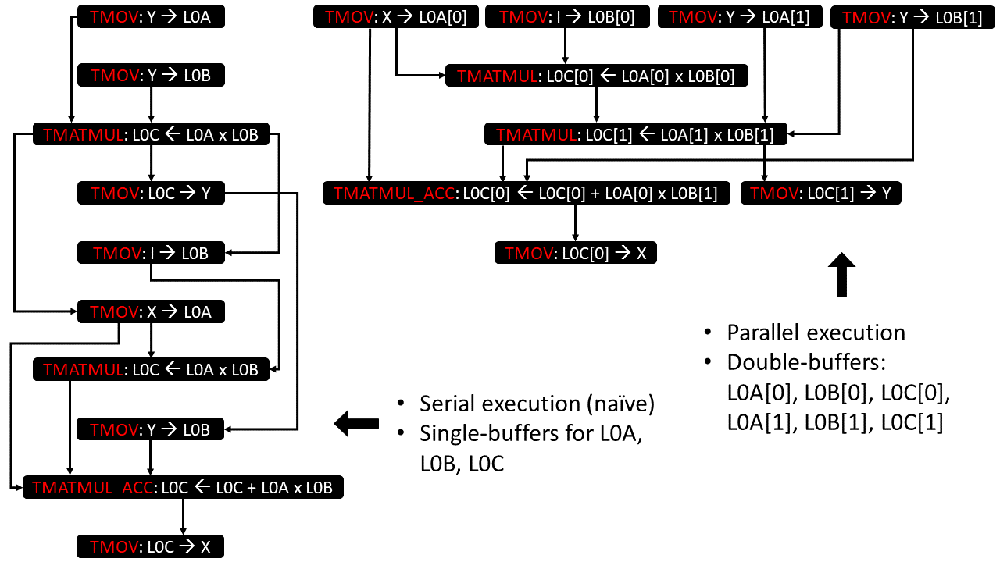
</p>

<a id="end-to-end-speed-up-for-chunkwise-gated-deltanet"></a>
# 端到端加速chunkwise Gated DeltaNet

验证chunkwise Gated DeltaNet 的整体加速。基线取SGLang所用的[Triton kernel](https://github.com/sgl-project/sgl-kernel-npu/blob/2026.03.01.post1/python/sgl_kernel_npu/sgl_kernel_npu/fla/chunk.py#L215)，仅将三角求逆这步替换为我们最好的PTO算子实现。还有一个额外麻烦要考虑：Triton 算子需要输入输出为**seq-first** layout（`[batch, seq, head, hidden]`，下文记为 **BSND**）。如果接入普通的batch求逆算子，还需要**额外两次 transpose**；算上 transpose，端到端相对 Triton 收益约 **1.08x**。

为去掉transpose开销，我们改写算子使其**原生读写BSND layout**：在 PTO-ISA 中调整访存 stride，把读写请求映射到正确地址。端到端收益提高到 **1.18x**。

<p align="center">
  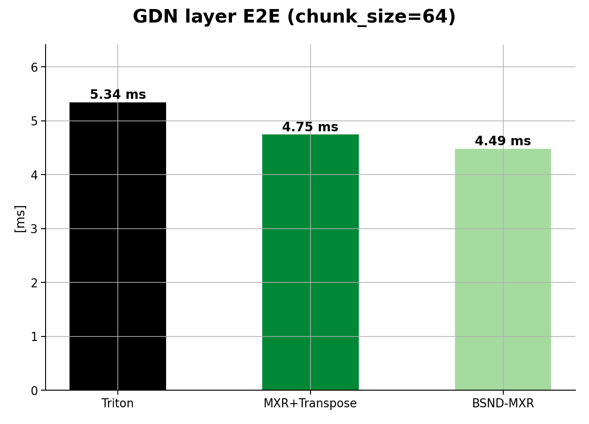
</p>

用 [torch-npu](https://gitcode.com/Ascend/pytorch) profiling 可见，PyTorch eager模式的一连串小 Triton kernel 受 **kernel launch** 开销主导，实际 kernel 执行时间占比不高；若用 [aclgraph](https://gitcode.com/Ascend/torchair/) 把多 kernel 入图，host 侧开销可大幅下降。**若只看 kernel 执行时间**，换上我们最好的求逆算子后 GDN 层加速约 **1.4x**：

<p align="center">
  
</p>


<a id="appendix"></a>
# 附录

<a id="background-on-floating-point-and-stability-analysis"></a>
## 数值稳定性分析

本文对**三角矩阵求逆**采用下列稳定性概念（更一般讨论见[7]、[2]）。下设 $c_1,c_2$ 为与矩阵阶数 $n$ 无关的全局常数， $\kappa(A)=\lVert A\rVert\,\lVert A^{-1}\rVert\geq 1$ 为 $A$ 的 2-范数条件数。

- 给定阶数 $n$ 的矩阵 $A$，目标是逼近其逆 $\widetilde A^{-1}$。  
- **Numerically stable** 的求逆算法满足：

$$
\| A^{-1} - \widetilde A^{-1}\| \leq c_1 n^{c_2} \cdot 2^{-t} \cdot \kappa(A)\cdot\|A^{-1}\|
$$

- **Logarithmically stable** 的算法满足：

$$
\| A^{-1} - \widetilde A^{-1}\| \leq c_1 n^{c_2} \cdot 2^{-t} \cdot \kappa^{P(\log(n))}(A)\cdot\|A^{-1}\|,
$$

其中 $P(x)$ 为低次多项式。  
- **Unstable** 的算法不满足上述任一类界（例如误差可随 $n$ 指数增长）。

显然，logarithmically stable 比 numerically stable 更容易放大误差。


<a id="detailed-stability-analysis-of-the-methods"></a>
## 各算法的精度对比

这里补充各算法在不同精度下的数值行为。我们关注 Ascend 910B 当前支持的 `float16` 与 `float32`。

我们关心的输入规模（LLM 场景）为 `16, 32, 64` 与 `128`。考虑随机三角矩阵，随机采样自 `[0,1/2)`：

```python
A = 0.5 * np.tril(np.random.rand(n, n), k=-1)
```

下图对 `float16` 与 `float32` 报告三类误差。记 $A=I+L$ 的精确逆矩阵为 $A^{-1}$，各方法输出为 $\widetilde A^{-1}$。

- **Max element-wise absolute error**（最大逐元素绝对误差）：

$$
\max_{i,j} |A^{-1}_{i,j} - \widetilde A^{-1}_{i,j}|.
$$

- **Max element-wise relative error**（最大逐元素相对误差）：

$$
\max_{i,j<i} \frac{|A^{-1}_{i,j} - \widetilde A^{-1}_{i,j}|}{|A^{-1}_{i,j}|}.
$$

- **Frobenius-norm relative error**（Frobenius 范数相对误差）：

$$
\frac{\|A^{-1} - \widetilde A^{-1}\|_F}{\|A^{-1}\|_F}.
$$

<p align="center">
  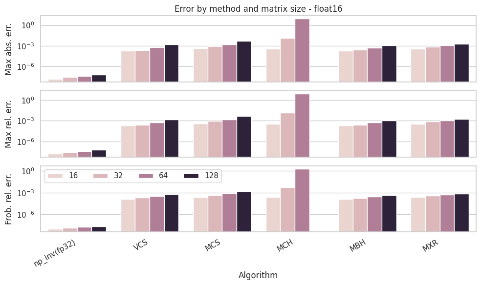
</p>

规模大于 `32` 时，**仅 MCH** 会给出明显不准的解。**MXR** 的精度接近其它更稳的方法，同时计算量与 **MCH** 同属约 $\approx 2\log(n)$ 次矩阵乘的量级。

<a id="bibliography"></a>
# 参考文献

**[1]** Bunch, James R., and John E. Hopcroft. "Triangular factorization and inversion by fast matrix multiplication." *Mathematics of Computation* 28.125 (1974): 231-236.

**[2]** Demmel, James, Ioana Dumitriu, and Olga Holtz. "Fast linear algebra is stable." *Numerische Mathematik* 108.1 (2007): 59-91.

**[3]** Yang, Songlin, Jan Kautz, and Ali Hatamizadeh. "Gated Delta Networks: Improving Mamba2 with Delta Rule." *The Thirteenth International Conference on Learning Representations*.

**[4]** Gallopoulos, Efstratios, Bernard Philippe, and Ahmed H. Sameh. *Parallelism in matrix computations*. Dordrecht: Springer, 2016.

**[5]** Zhang, Yu, et al. *“KIMI LINEAR: An Expressive, Efficient Attention Architecture.”* [**arXiv preprint arXiv:2510.26692**](https://arxiv.org/pdf/2510.26692), 2025.

**[6]** Higham, Nicholas J. "The accuracy of solutions to triangular systems." *SIAM Journal on Numerical Analysis* 26.5 (1989): 1252-1265.

**[7]** Higham, Nicholas J. *Accuracy and stability of numerical algorithms*. SIAM, 2002.

**[8]** Zhong, S., Xu, M., Ao, T. and Shi, G., 2025. [Understanding Transformer from the Perspective of Associative Memory](https://arxiv.org/abs/2505.19488). arXiv preprint arXiv:2505.19488.
